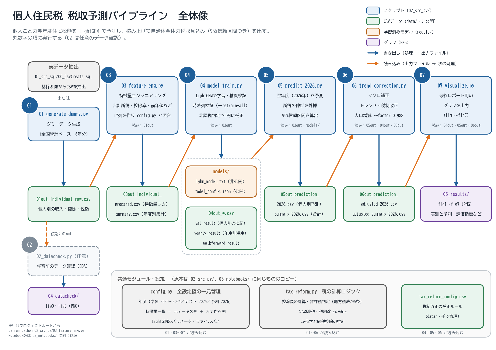

# 個人住民税予測モデル

## 概要

住民税は自治体の主要財源のひとつである。翌年度の税収をどれだけ正確に見通せるかは、予算編成の精度に直結する。

このプロジェクトは、**個人の収入・控除情報をもとに翌年の住民税額を予測する機械学習モデル**を構築するパイプラインである。LightGBM（勾配ブースティング）を用いて個人レベルの税額を推定し、それを集計することで自治体全体の税収見込みを算出する。


実務では実データをもとにプログラムを実行するが、GitHub にはダミーデータ生成機能を追加し、その出力データを元にプロジェクトを実行している。



> パイプラインの実行順とファイルの関係（`実行アウトライン概要図.png`）

---

## 本プロジェクトの役割

| 項目 | 内容 |
|---|---|
| 位置づけ | 予算編成での税収見込み算出を補助する**支援ツール**。出力（個人別予測・信頼区間・自治体合算値）は参考値であり、税額の決定・徴収は既存の税務基幹システムが担う |
| 対象範囲 | 個人住民税（均等割＋所得割）の翌年度税収予測に限定 |
| 処理の流れ | 基幹系から抽出した個人別の収入・控除データ（`01_src_sql/00_CsvCreate.sql`）を起点に、特徴量エンジニアリング→学習→翌年予測→マクロ補正→可視化。最終出力は「自治体全体の翌年度税収見込み額（信頼区間つき）」 |
| ダミー版の役割 | 実データがない段階でもパイプライン全体と精度検証手法を確認できるPoC用途。全国統計に基づく疑似データで代替 |
| 実データ版の役割 | 基幹系データを投入する本番想定。列名・控除計算式を実データに置き換える。控除をフラグでしか持たない場合は金額化の加工を追加（`03_feature_eng.py`） |
| 前提と限界 | 過去の実績パターンの学習に基づく。税制改正・急激な経済変動・自治体固有の制度（等級地ごとの非課税基準等）は`data/tax_reform_config.csv`等の手動補正でカバーする。補正を未設定の場合は精度が異なる |

---

## 結果の概要

> 詳細な検証条件・全指標は「[ダミーデータでの結果](#ダミーデータでの結果)」「[実データでの検証結果](#実データでの検証結果)」を参照。

| | 使用モデル | 検証データ規模 | 2026年度 税収予測 | 前年比 | 集計誤差率（テスト年2025） | 備考 |
|---|---|---|---:|---:|---:|---|
| ダミーデータ検証 | LightGBM（勾配ブースティング木） | 597,000件（6年分） | 242.22億円 | +5.87% | +0.01% | 95%信頼区間 [238.25〜246.38] 億円／WMAPE 0.53% |
| 実データ検証 | 同上 | 約1,340,000件（6年分） | 非公開 | +4.91% | +0.61% | WMAPE 6.25%／個人単位の誤差（RMSE・R²）はダミーより大きいが、自治体全体の集計精度は既存ツールより向上した |

- LightGBMで個人ごとの翌年度住民税額を予測し、自治体全体で積み上げることで、高精度に翌年度税収見込みを算出することが目的のモデルである。
- 個人単位の予測誤差は高所得層等の外れ値に引っ張られやすいが、自治体が最終的に必要とする「税収合計」への影響は限定的である（多くの誤差が相殺されるため）。
- 実データでも、非課税判定（地方税法295条）による強制0円補正や上限パーセンタイルでのクリップなど、税制ルールベースの後処理と組み合わせることで集計精度を担保している。

---

## 選定モデル

> LightGBM（勾配ブースティング木）

| 観点 | 内容 |
|---|---|
| 税額の計算が階段状 | 所得控除・非課税基準（地方税法295条）は「ある所得を境に切り替わる」構造。決定木は分割でそのまま表現でき、線形回帰のように閾値ごとの特徴量を人手で作る必要がない |
| 前処理が少ない | 分割は値の大小だけで決まるため、説明変数の対数変換や標準化が不要。自治体ごとに分布が違っても扱いやすい |
| 実データとの相性 | 基幹系DBからの抽出データは全項目が数値（性別・寡婦・障害者等もコード化済み）で、そのまま入力できる |
| 外れ値への耐性 | 高額納税者は個人単位の誤差（RMSE・WMAPE）を押し上げるが、主指標の集計誤差率への影響は小さい |
| 予測後にルールで補正 | ①課税者は均等割額（`MIN_TAX`）を下限にクリップ、②非課税基準に該当する人は0円に上書き（[`_predict_with_nontaxable`](02_src_py/04_model_train.py#L100)）。モデルの予測だけに頼らない設計 |

---

## 実行方法

グラフを都度確認しながら進めたい場合や、途中の中間データを見ながら試行錯誤したい場合はNotebook版(`03_notebooks/`)、バッチ実行・自動化にはCLI版（`02_src_py/`）を使用することを想定。

### 注意
`config.py`・`tax_reform.py`は、実行スクリプト本体と同じ`02_src_py/`に置いている（**こちらが原本**）。スクリプトは同一フォルダのモジュールをそのまま`import`するため、`PYTHONPATH`の設定も`sys.path`の操作も不要である。`data/`等への相対パスはカレントディレクトリ基準のため、各スクリプトの冒頭に「`02_src_py/`の中から実行された場合はプロジェクトルートへ戻す」処理を入れている（2026-09-17追加）。このため**プロジェクトルート・`02_src_py/`のどちらからでも実行できる**。

なお`03_notebooks/`にも同じ`config.py`・`tax_reform.py`を配置している（Notebook単体で読めるようにするための公開用コピー）。**設定値を変更するときは原本の`02_src_py/config.py`を編集し、`03_notebooks/config.py`へコピーして同期すること。**

### CLI版（`02_src_py/`）

```bash
# 実データがある場合（03から開始）
uv run python 02_src_py/03_feature_eng.py
uv run python 02_src_py/04_model_train.py --retrain-all   # walk-forward検証 + 全年再学習
uv run python 02_src_py/05_predict_2026.py
uv run python 02_src_py/06_trend_correction.py
uv run python 02_src_py/07_visualize.py

# ダミーデータで試す場合（01から開始）
uv run python 02_src_py/01_generate_dummy.py
uv run python 02_src_py/03_feature_eng.py
uv run python 02_src_py/04_model_train.py --retrain-all
uv run python 02_src_py/05_predict_2026.py
uv run python 02_src_py/06_trend_correction.py
uv run python 02_src_py/07_visualize.py
```

Windows PowerShellでも同じコマンドがそのまま使用可能

`02_src_py/`の中から実行する場合は、フォルダ名を除いて`uv run python 06_trend_correction.py`のように指定する（各スクリプトの冒頭にある実行例はこの形で記載）。

### Notebook版(`03_notebooks/`)での実行

`03_notebooks/`配下に、各スクリプトと同一ロジックのJupyter Notebook版（`01_generate_dummy.ipynb`〜`07_visualize.ipynb`）を用意している。CLI版との違いは以下の通り。

- `main()`に集約せず、関数定義・実行・結果表示・保存をセル単位に分割しており、上から順に実行すると各ステップの出力（表・グラフ）がその場に表示される。
- CLI引数（`--walkforward`, `--year`等）に相当する設定は、各ノートブック内の`NOTEBOOK_ARGS`セルで指定する（`NOTEBOOK_ARGS = ["--retrain-all"]`のようにCLIと同じ文字列を並べる）。
- `04_model_train.ipynb`は、このREADMEに載せている結果と同じになるよう`NOTEBOOK_ARGS = ["--retrain-all"]`を設定済み。
- `03_notebooks/`から開いてそのまま実行してもプロジェクトルート基準の相対パスが解決できるよう、各ノートブックの先頭で自動的にカレントディレクトリをルートへ戻す処理が入っている。VS Code等で開く場合は`.venv`（`2026-chotei-01`）をカーネルに選択すること。


---

## フォルダ構成

```
.
├── 01_src_sql/     実データを基幹系DBから抽出するSQL
├── 02_src_py/      パイプライン本体（CLI版 01〜07）と、設定 config.py・税制ロジック tax_reform.py【原本】
├── 03_notebooks/   02_src_py と同じ処理のNotebook版（公開・閲覧用）
├── 04_datacheck/   データ確認用のグラフ（02_datacheck の出力。fig0〜fig8）
├── 05_results/     最終レポート用のグラフ（07_visualize の出力。fig1〜fig7）
├── data/           入力・中間・予測結果のCSV【非公開】
├── models/         学習済みモデル【非公開】と、その設定の記録 model_config.json【公開】
└── pyproject.toml / uv.lock / .python-version   Python環境の定義（uv sync で再現）
```

処理の流れ：`01_src_sql`（抽出）→ `data/` → `02_src_py` または `03_notebooks`（加工・学習・予測）→ `models/`・`04_datacheck/`・`05_results/`

各ファイルの中身や入出力の詳細は、次の「ファイル構成」を参照。

---

## ファイル構成

```
.
├── 01_src_sql/
│   └── 00_CsvCreate.sql          # 基幹系DBからの実データ抽出SQL
│
├── 02_src_py/                    # 実行スクリプト本体（CLI版。ルート／02_src_py どちらからでも実行可）
│   ├── config.py                 # 【原本】全設定値の一元管理（ここだけ触ればパラメータ調整可能）
│   ├── tax_reform.py             # 【原本】税制改正補正ロジック（共通モジュール）
│   │
│   ├── 01_generate_dummy.py      # ダミーデータ生成
│   │     in  : config.pyの設定値
│   │     out : data/01out_individual_raw.csv
│   │
│   ├── 02_datacheck.py           # データチェック（EDA・任意ステップ）
│   │     in  : data/01out_individual_raw.csv
│   │     out : 04_datacheck/*.png
│   │
│   ├── 03_feature_eng.py         # 特徴量エンジニアリング
│   │     in  : data/01out_individual_raw.csv
│   │     out : data/03out_individual_prepared.csv, data/03out_individual_summary.csv
│   │
│   ├── 04_model_train.py         # モデル学習・精度検証
│   │     in  : data/03out_individual_prepared.csv
│   │     out : models/lgbm_model.txt, models/model_config.json,
│   │           data/04out_val_result.csv, data/04out_yearly_result.csv,
│   │           data/04out_walkforward_result.csv（--walkforward/--retrain-all時のみ）
│   │
│   ├── 05_predict_2026.py        # 翌年度予測
│   │     in  : data/03out_individual_prepared.csv, models/lgbm_model.txt, models/model_config.json
│   │     out : data/05out_prediction_YYYY.csv, data/05out_prediction_summary_YYYY.csv
│   │
│   ├── 06_trend_correction.py    # マクロ補正（トレンド・税制改正）
│   │     in  : data/05out_prediction_YYYY.csv, data/04out_yearly_result.csv, data/03out_individual_prepared.csv
│   │     out : data/06out_prediction_adjusted_YYYY.csv, data/06out_prediction_adjusted_summary_YYYY.csv
│   │
│   └── 07_visualize.py           # グラフ出力
│         in  : 04〜06の出力CSV群, models/model_config.json
│         out : 05_results/*.png
│
├── 03_notebooks/                 # 上記と同一ロジックのNotebook版（公開・閲覧用）
│   ├── config.py                 # 02_src_py/config.py のコピー（編集は原本側で行い、ここへ同期）
│   ├── tax_reform.py             # 02_src_py/tax_reform.py のコピー（同上）
│   │
│   ├── 01_generate_dummy.ipynb
│   ├── 02_datacheck.ipynb
│   ├── 03_feature_eng.ipynb
│   ├── 04_model_train.ipynb
│   ├── 05_predict_2026.ipynb
│   ├── 06_trend_correction.ipynb
│   └── 07_visualize.ipynb
│
├── 04_datacheck/                 # 02_datacheck.py の出力（EDA図。fig0〜fig8）
│
├── 05_results/                   # 07_visualize.py の出力（最終レポート図。fig1〜fig7）
│
├── data/                         # 非公開（.gitignore対象）。実データ運用時もこのフォルダを使う
│   ├── 01out_individual_raw.csv        # 入力データ（実データ or ダミー）← 01 の出力
│   ├── 03out_individual_prepared.csv   # 特徴量追加済みデータ ← 03 の出力
│   ├── tax_reform_config.csv           # 税制改正補正ルール（手動管理・to_csv対象外）
│   ├── 04out_yearly_result.csv         # 年度別合算精度 ← 04 の出力
│   ├── 04out_val_result.csv            # 個人別検証結果 ← 04 の出力
│   ├── 04out_walkforward_result.csv    # walk-forward各フォールドの精度（--walkforward/--retrain-all時のみ）← 04 の出力
│   ├── 05out_prediction_2026.csv       # 個人別予測値 ← 05 の出力
│   └── 06out_prediction_adjusted_2026.csv  # 補正後予測値 ← 06 の出力
│
└── models/                       # lgbm_model.txt は非公開、model_config.json のみ公開
    ├── lgbm_model.txt            # 学習済みモデル【非公開】
    └── model_config.json         # 【公開】04が出力する設定の記録（使った特徴量・学習年・パラメータ・検証モード）
```

> `data/`と`models/lgbm_model.txt`は`.gitignore`対象（非公開）。`models/model_config.json`だけは、このREADMEの結果がどの特徴量・学習年・検証モードで出たかを`config.py`を開かなくても確認できるよう公開している。`lgbm_model.txt`は実データ版も同じパスに書き込み、実データ由来の情報を含み得るため公開しない。GitHub上のフォルダ表示順（`01_src_sql`〜`05_results`）は、アルファベット順にしか並ばないGitHubの仕様に合わせて連番を振ったものであり、パイプラインの処理順（SQL抽出→スクリプト→Notebook→EDA→最終成果物）と一致させている。

- 出力ファイル名の先頭2桁は、そのファイルを`to_csv`で書き出したパイプラインのステップ番号を示す（例: `03out_`＝`03_feature_eng.py`の出力）。`tax_reform_config.csv`は唯一の例外で、どのステップも書き出さない手動管理の入力ファイルのためプレフィックスを付けていない。
- 実データCSVに必要な列は `02_src_py/03_feature_eng.py` 冒頭のドキュメントを参照。SQLでの抽出方法は `01_src_sql/00_CsvCreate.sql` を参照。

---

## ダミーデータでの結果

> `01_generate_dummy.py`→`03_feature_eng.py`→`04_model_train.py --retrain-all`→`05_predict_2026.py`→`06_trend_correction.py`→`07_visualize.py`を最新コードで再実行した結果（実データではなくダミーデータ）。フォーマットは下記「実データでの検証結果」と揃えている。

### 検証条件

| 項目 | 内容 |
|---|---|
| データ種別 | ダミーデータ（`01_generate_dummy.py`生成、全国統計ベース） |
| 使用スクリプト | ダミー版 無印（`02_src_py/01〜07_*.py`） |
| 実行コマンド・オプション | `04_model_train.py --retrain-all`（walk-forward検証＋全年再学習） |
| 学習データ年度範囲（`TRAIN_YEARS`） | 2020〜2024年（`--retrain-all`のため最終モデルは`TEST_YEAR`含む2020〜2025年で再学習） |
| テスト年度（`TEST_YEAR`）／予測年度（`PREDICT_YEAR`） | 2025年 ／ 2026年 |
| レコード数 | 597,000件（6年分、1年あたり98,800〜100,000件） |

### 評価指標（TRAIN in-sample / ウォークフォワード最終フォールド TEST out-of-sample）

| 指標 | 意味・式 | TRAIN（2020〜2025 in-sample） | TEST（fold4: train=2020〜2024→test=2025） | 備考 | 位置づけ |
|---|---|---|---|---|---|
| 集計誤差率 | 合計のズレの割合<br>（予測合計−実績合計）÷実績合計 | -0.00% | +0.01% | 符号付きのため、個人ごとの誤差のプラス・マイナスが打ち消し合う |（**主指標**）税収見込みの精度そのもの |
| WMAPE | 円で重み付けした誤差率<br>Σ\|誤差\|÷Σ実績 | 0.48% | 0.53% | 非課税者含む。集計誤差率の上限（全員が同じ向きに外れた場合に一致） |（第2指標）円ベース：税収のうち何円分を個人に誤って割り振ったか。高額納税者の外れは税額に比例して効く |
| MAPE | 1人ずつの誤差率の平均<br>平均(\|誤差\|÷実績) | 1.61% | 1.40% | 課税者のみ（実績0円は分母にできないため除外） |（参考）人数ベースで、一般の納税者1人ひとりの当たり具合。少額納税者の外れで大きくなり、非課税者の誤予測は反映されない |
| MAE | 1人あたりの平均誤差額<br>平均(\|誤差\|) | 972円 | 1,232円 | | （参考）1人あたり平均何円外れるかの把握。税収合計の精度判断には使わない |
| RMSE | 二乗平均の平方根<br>√平均(誤差²) | 2,338円 | 4,545円 | |（参考）高額納税者など大きな外れの荒れ具合の確認。外れ値に引っ張られるため、税収合計の精度判断には使わない |
| R² | 税額のばらつきの説明割合<br>1−Σ誤差²÷Σ(実績−平均)² | 1.000 | 1.000 | |（参考）個人単位の当てはまりを税額の規模によらず比べるための指標（RMSEを税額のばらつきで割ったもの）。ダミーと実データ、年度間で見比べて異変に気づくために計算しており、税収合計の精度判断には使わない |

> `--retrain-all`モードの仕様上、TRAIN列は`TRAIN_YEARS`+`TEST_YEAR`全年度を使った最終モデルのin-sample評価、TEST列はウォークフォワード最終フォールド（fold4）のout-of-sample評価であり、異なるモデルの数値である点に注意。


### 年度別合算精度（`04`最終モデルによる in-sample、参考値）

| 年度 | 実測（億円） | 予測（億円） | 集計誤差率 |
|---:|---:|---:|---:|
| 2020 | 179.87 | 179.84 | -0.01% |
| 2021 | 192.30 | 192.25 | -0.03% |
| 2022 | 196.62 | 196.66 | +0.02% |
| 2023 | 205.66 | 205.68 | +0.01% |
| 2024 | 215.66 | 215.65 | -0.00% |
| 2025 | 228.80 | 228.80 | -0.00% |

### 2026年度予測サマリー（`05`→`06`）

| 項目 | 値 |
|---|---|
| 前年実績（2025年） | 228.80億円 |
| 2026年度 税収合計（最終・`06`のマクロ補正後） | 242.22億円（前年比 +5.87%） |
| 予測人数（うち課税者数） | 98,800人（78,382人） |
| 95%信頼区間 | [238.25 〜 246.38] 億円 |
| 所得の外挿率（実績トレンド直近2年平均） | 給与収入 +6.78%／事業所得 +0.73%／年金所得 +2.91%／総所得金額等 +4.54% |
| `06`トレンド補正・税制改正マクロ補正 | いずれも「適用する補正なし」（補正前後で242.22億円のまま） |

### 所見・特記事項

- ウォークフォワード検証（fold1〜4）はすべて誤差率±0.1%以内・個人MAPE 1.4〜1.7%で安定しており、バイアスや過学習の兆候は見られない。
- 予測値の押し上げ要因は給与収入トレンド（直近2年平均 +6.78%）が最大で、年金所得（+2.91%）・事業所得（+0.73%）もプラス方向に外挿されている。
- ダミーデータはあくまで全国統計ベースの疑似データであるため、この数値をそのまま自治体の実務判断に用いることはできない。汎用性を持たせるため、正規分布に近いデータ生成となっているため、学習精度が高い傾向にある。しかし、実データでの検証は自治体ごとにデータの分布が大きく異なることから、データ加工等のフローや評価指標の設定は独自で検証する必要がある。

---

## 実データでの検証結果

- 下記は実データをもとに検証した結果である。
- 金額は非公開とし、評価指標と集計誤差のみを記載する。
- ダミーデータとの相違点や別途の取り組み、今後の課題等を記載

### 検証条件

| 項目 | 内容 |
|---|---|
| データ種別 | 実データ（`01_src_sql/00_CsvCreate.sql`より csvデータ抽出） |
| 使用スクリプト | 実データ版（`03/04/05/06/07_*REAL_*.py`） |
| 実行コマンド・オプション | `04_model_train.py --retrain-all`（walk-forward検証＋全年再学習） |
| 学習データ年度範囲（`TRAIN_YEARS`） | 2020〜2024年（`--retrain-all`のため最終モデルは`TEST_YEAR`含む2020〜2025年で再学習） |
| テスト年度（`TEST_YEAR`）／予測年度（`PREDICT_YEAR`） | 2025年 ／ 2026年 |
| レコード数 | 約1,340,000件（6年分、1年あたり約220,000件） |

### 評価指標（TRAIN / TEST）

| 指標 | 意味・式 | TRAIN | TEST | 備考 | 位置づけ |
|---|---|---|---|---|---|
| 集計誤差率 | 合計のズレの割合<br>（予測合計−実績合計）÷実績合計 | +0.25% | +0.61% |  |（**主指標**）税収見込みの精度そのもの |
| WMAPE | 円で重み付けした誤差率<br>Σ\|誤差\|÷Σ実績 | 4.38% | 6.25% | 非課税者含む。集計誤差率の上限 |（第2指標）円ベース：税収のうち何円分を個人に誤って割り振ったか。高額納税者の外れは税額に比例して効く |
| MAPE | 1人ずつの誤差率の平均<br>平均(\|誤差\|÷実績) | 8.46% | 11.52% | 課税者のみ（実績0円は除外） |（参考）人数ベースで、一般の納税者1人ひとりの当たり具合。少額納税者の外れで大きくなり、非課税者の誤予測は反映されない |
| MAE | 1人あたりの平均誤差額<br>平均(\|誤差\|) | 3,833円 | 5,897円 | 円 |（参考）1人あたり平均何円外れるかの把握。税収合計の精度判断には使わない |
| RMSE | 二乗平均の平方根<br>√平均(誤差²) | 126,006円 | 176,853円 | 円 |（参考）高額納税者など大きな外れの荒れ具合の確認。外れ値に引っ張られるため、税収合計の精度判断には使わない |
| R² | 税額のばらつきの説明割合<br>1−Σ誤差²÷Σ(実績−平均)² | 0.818 | 0.712 | |（参考）個人単位の当てはまりを税額の規模によらず比べるための指標（RMSEを税額のばらつきで割ったもの）。ダミーと実データ、年度間で見比べて異変に気づくために計算しており、税収合計の精度判断には使わない |


### 年度別合算精度（`04`最終モデルによる in-sample、参考値）

| 年度 | 実測（億円） | 予測（億円） | 集計誤差率 | 
|---:|---:|---:|---:|
| 2020 | 非公開 | 非公開 | -0.36% |
| 2021 | 非公開 | 非公開 | +0.16% |
| 2022 | 非公開 | 非公開 | +0.01% |
| 2023 | 非公開 | 非公開 | -0.23% |
| 2024 | 非公開 | 非公開 | +0.42% |
| 2025 | 非公開 | 非公開 | +0.61% |

### 2026年度予測サマリー（`05`→`06`）

| 項目 | 値 | 備考 |
|---|---|---|
| 2026年度 税収合計予測 | 前年比 +4.91% | 税制改正（減税）以上に所得の上昇に伴った税収の増加が継続 |
| 2026年度予測と実績の集計誤差率（2026年6月30日時点） | 0.41% | 年度途中時点の暫定値。上の評価指標表にある集計誤差率（テスト年2025の+0.61%）とは別の数値 |
| 予測人員 | 約220,000人 | |


### 所見・特記事項
- ダミーデータを用いた結果と比べて精度が低いことが伺える。ダミーデータが正規分布に近い形状であるのに対し、実データは特定区間の偏りや外れ値が顕著であったことが主な原因と考えられる。個人単位の精度は誤差が大きいものの、本プロジェクトの目的である、税収の予測から鑑みると、集計誤差率の精度としてはダミーデータ同等の精度を保つことができていると読み取れる。
- 一定数極端に税額が大きい納税者（詳細は非公表）が存在するため、多少の予測誤差が発生する。その上で学習精度のために、実データのみパーセンタイルでクリップし、値を丸めるなどのデータ加工を実装した。その影響で`05`の予測の集計結果が実データの結果より過小になったことが伺える。ただし、少数の高額納税者については、単年の高額所得の可能性や、転出・死亡による翌年の税収0円等の可能性を考慮すると、前年データをそのまま予測に用いるよりはリスクを抑えられることから、学習段階でのデータの上限設定は有効と考える。

### 実データにおける取り組み
各団体によって人口推移、所得平均、分布等が異なるため、カスタマイズ処理は必要である。下記は一例。

#### ダミー版との主な相違点

| 項目 | ダミー版（`02_src_py/`） | 実データ版 |
|---|---|---|
| 所得列 | 全国統計ベースで生成した個別所得列。`03`で合計して`総所得金額等`を作る | 抽出データに合計所得の列が既にあるためそのまま使用 |
| 障害者・寡婦・配偶者・扶養控除 | 金額列として生成 | 抽出データはコード値・人数で持つため、`03`で住民税の控除額表に基づき金額へ変換 |
| 目的変数の変換・損失関数 | なし（無変換・二乗誤差） | `--target-transform`（none/log/winsorize/log_winsorize）と`--objective`（regression_l2/regression_l1/huber）をCLIで選択 |

#### 今後の課題

- 2026年予測では、対象者を2025年と同じ人・同じ人数とし、全員を継続者として扱っている。死亡・転出・転入による増減と加齢（年齢区分の繰り上がり）が反映されない。現状は`06_trend_correction.py`において人口推移を直接指定しているが、年齢区分・所得区分等には未対応のため実装検討中。
- 2024年定額減税による税収への影響について、本モデルでは定額減税前の税額に戻して学習している。今後同様の税制改正における`tax_reform.py`の精度検証が必要。
- 所得上位数%の高額所得者の細分化。所得別の翌年継続率（給与なら継続確率高、分離所得なら低等の仮説）を把握し、誤差を反映する。


---

## 各ファイルの詳細

### `02_src_py/config.py` — 設定値の一元管理

すべてのパラメータはここに集約されている。このファイルの数値を変えることで動作を調整できる。

| 設定グループ | 主な設定項目 | 変更タイミング |
|---|---|---|
| 年度設定 | `TRAIN_YEARS`, `TEST_YEAR`, `PREDICT_YEAR` | 年度更新時 |
| モデル | `LGBM_PARAMS` | 精度チューニング時 |
| 税控除推計 | `FURUSATO_PARAMS`, `HOUSING_PARAMS` | 実績データ取得後 |
| ダミーデータ規模 | `N_PER_YEAR`, `TURNOVER_RATE` | 計算コスト調整時 |
| 人口増減 | `POPULATION_GROWTH_RATES` | 年度別人口規模を変えたいとき |
| 男女比 | `GENDER_RATIO` | 対象自治体の実態に合わせるとき |
| 年齢構成 | `AGE_GROUPS`, `AGE_WEIGHTS` | 対象自治体の実態に合わせるとき |
| 賃金上昇率 | `APPLY_WAGE_GROWTH`, `SALARY_GROWTH_RATES`, `PENSION_GROWTH_RATES` | 年別の給与・年金上昇率を実績に合わせるとき |
| 検証モード | `VALIDATION_MODE`, `WF_MIN_TRAIN_YEARS` | CLIオプション未指定時のデフォルト設定 |

---

### `02_src_py/01_generate_dummy.py` — ダミーデータ生成

実データがない状態でもモデルの動作確認ができるよう、統計的に現実に近いダミーデータを生成する。

**生成ロジックの設定**

| 項目 | 設定内容 |
|---|---|
| 給与収入 | 国税庁「民間給与実態統計調査（令和6年分）第14図」の年齢5歳刻み・男女別の平均給与を参照して収入分布を設定。単一の平均値ではなく年代・性別ごとに分けることで実態に近い分布を再現している。 |
| 年金収入 | 厚生労働省「厚生年金保険・国民年金事業の概況（令和5年度）」から年齢区分別の平均受給額（国民年金＋厚生年金の合計）を参照。60歳未満はゼロとし受給開始年齢を考慮している。 |
| 医療費控除の申告率 | 厚生労働省の年齢階級別医療費支出割合（44歳以下17.9% / 45〜64歳22.0% / 65歳以上60.1%）をもとに確率を設定し、全体の申告率が約29%になるよう調整している。 |
| 年齢構成 | 総務省統計局2024年データの20歳以上人口の年齢5歳刻み比率を使用。 |
| 男女比 | e-Stat（政府統計の総合窓口）より20歳以上の人口比率を参照し、女性51.7% / 男性48.3%に設定。 |
| 人口推移 | `POPULATION_GROWTH_RATES`による年別の人口倍率で各年のレコード数を調整。在籍者の一定割合（`TURNOVER_RATE`）が毎年入れ替わる流入・退出モデルを採用している。 |
| 賃金上昇率 | `APPLY_WAGE_GROWTH = True` のとき、給与（`SALARY_GROWTH_RATES`）と年金（`PENSION_GROWTH_RATES`）に年別の上昇率を個別適用する。在籍継続者には前年比の上昇率、新規流入者には基準年からの累積上昇率を適用する。`False` に設定すると全年一律 +0.5%/年の旧動作に戻る。 |

**留意点**

- 特定バイアスを避けるため、収入・控除の設定値はすべて全国統計から導出している（個別自治体の特性は反映していない）。
- 新規流入者の給与は独自の水準で生成するが、給与以外の所得（事業・不動産・年金・配当・分離課税等）は初年度と同じ確率・分布で生成し、合計所得から控除・税額を計算する（2026-09-13変更。従来は給与以外が0円固定で、年を追うごとに事業所得・不動産所得の保有者が減っていた）。
- 事業所得・不動産所得は正規分布で生成するため、赤字（マイナス）の人も含む（損失を表すものとして許容）。

---

### `02_src_py/02_datacheck.py` — データチェック（EDA）

`data/01out_individual_raw.csv`（実データ or ダミー）を可視化し、`04_datacheck/`にfig0〜fig8として出力する。モデル学習前のデータ確認用途で、パイプラインの必須ステップではない。

| 図 | 内容 | 目的 |
|---|---|---|
| fig0 | 課税・非課税の人数（年度別） | 人口に対する納税者の割合チェック |
| fig1 | 給与収入・年金収入・年税額のヒストグラム | 各ブロックごとの人数チェック |
| fig2 | 年税額との相関 上位10・下位10（税額の内訳列と課税標準額は除外） | 目的変数（年税額）との相関チェック |
| fig3 | 年齢区分×性別の箱ひげ図（給与収入・年金収入・年税額） | 年齢・性別ごとの所得分布チェック |
| fig4 | 給与収入と給与所得の年度推移（合計・平均） | 年度ごとの給与推移確認（税制改正の影響チェック） |
| fig5 | 事業所得・不動産所得・分離課税所得（合計）の年度推移 | 年度ごとの推移確認 |
| fig6 | 給与収入・年金収入と年税額の散布図 | 相関チェック＆性別ごとのばらつきチェック |
| fig7 | 税額控除（ふるさと納税・住宅ローン控除）の散布図（所得税率区分別） | 所得金額と税額控除の関係チェック |
| fig8 | 定額減税の影響（年度別、年齢区分×性別、年齢区分別推移） | 減税政策による影響チェック |

---

### `02_src_py/03_feature_eng.py` — 特徴量エンジニアリング

生データに含まれない「モデルへの入力として有効な列」を追加する。

**主な追加特徴量**（列名は`01_src_sql/00_CsvCreate.sql`のフィールド名に合わせた日本語名）

| 特徴量 | 内容 |
|---|---|
| `総所得金額等` | 全所得種別の合計 |
| `給与所得有無` 等 | 所得種別フラグ（給与・事業・年金・不動産・配当・分離課税） |
| `差引所得控除合計` | 所得控除合計 |
| `所得控除率`・`課税標準率` | 控除合計 ÷ 合計所得、課税標準額 ÷ 合計所得（所得水準によらず比較できる比率） |
| `年齢区分番号` | 年齢5歳刻み区分の数値（1〜15。80-84・85-89・90overを含む） |
| `継続者フラグ` | 前年データあり（継続者）フラグ |
| `前年_年税額` 等 | 前年の年税額・総所得金額等・課税標準額（時系列での変化をモデルに伝える） |
| `総所得金額等_前年差` | 合計所得の前年差額 |

**留意点**

- `市町村_均等割`・`都道府県_所得割`など税額内訳列（`LEAK_COLS`）は、合計すると目的変数と一致するため特徴量から除外している（リーク防止）。

---

### `02_src_py/04_model_train.py` — モデル学習・精度検証

**モデル選定：LightGBM**

住民税の計算は給与や控除の組み合わせによる非線形な計算体系であり、木ベースのアンサンブルモデルが適合しやすい。LightGBMは大量の数値列に対して高速かつ高精度である。翌年以降の検証に引き続き使用するにあたり、実データの更新や運用職員の引継ぎ等から、複数モデルのアンサンブルは現時点では予定していない。

**検証モード（CLIオプションで切り替え）**

| オプション | 動作 | 使いどころ |
|---|---|---|
| `--standard`（デフォルト） | `TRAIN_YEARS` で学習 → `TEST_YEAR` で評価（1回のホールドアウト） | 動作確認・手早い精度確認 |
| `--walkforward` | fold1〜fold4 の時系列クロスバリデーション | モデルの安定性確認・バイアス検出 |
| `--retrain-all` | walk-forward 検証 → `TRAIN_YEARS + TEST_YEAR` 全年で再学習 | **実データ運用時の推奨フロー** |

`--retrain-all` の場合、walk-forward の最終フォールド（fold4）のアウトオブサンプル予測を `04out_val_result.csv` として使用するため、評価の公平性は保たれる。最終モデルは全年データを学習済みのため、直近年（2025年）のパターンも反映した状態で2026年を予測できる。

各フォールドの精度は `data/04out_walkforward_result.csv` に保存される。

**評価指標**

| 指標 | 意味 | 役割 |
|---|---|---|
| 集計誤差率 | （予測合計−実績合計）÷ 実績合計（符号付き） | **税収予測の主指標** |
| WMAPE | 誤差の絶対値の合計 ÷ 実績の合計（非課税者含む）＝ 各人の誤差率を実績の税額で重み付けした平均 | 円ベース。集計誤差率の上限。個人への税額の割り振りの正確さ |
| MAE | 個人1人あたりの予測誤差（円） | 誤差の絶対規模の把握 |
| RMSE | 誤差の二乗平均の平方根（円） | 大きな外れ（高額納税者など）の荒れ具合の確認 |
| MAPE | 課税者1人ひとりの誤差率の単純平均（実績0円は除外） | 参考指標：人数ベースの当たり具合。少額納税者の外れで大きくなり、非課税者の誤予測は反映されない |
| R² | 予測の当てはまり度（1.0が完全一致） | 参考指標：個人単位の当てはまりを規模によらず比較（RMSEを税額のばらつきで割ったもの）。税収合計の精度判断には使わない |

> **集計誤差率を主指標とする理由**：自治体が必要とするのは「税収合計」の精度であり、予測合計と実績合計の差をそのまま表すため。WMAPEは個人ごとの誤差の絶対値を合計するため打ち消し合いを含まず、集計誤差率の上限になる（全員が同じ向きに外れた場合に一致）。そのため WMAPE は、個人への税額の割り振りの正確さを見る指標として併記している。

**留意点**

- 税制改正がある年のラベルは `tax_reform_config.csv` の `label_correction` で補正してから学習する（改正の影響を過去年に誤帰属させない）。
- 非課税基準（地方税法第295条）以下の予測値は強制的に0円に上書きされる。
- `year` は特徴量（FEATURE_COLS）に含まれない。木モデルは訓練範囲外の年値を外挿できないためであり、年ごとの経済動向はダミーデータの上昇率設定や実データの特徴量分布として取り込む設計になっている。
- 学習結果の設定（特徴量列・ハイパーパラメータ・検証モード等）は`models/model_config.json`にJSON形式で保存され、`05_predict_2026.py`・`07_visualize.py`が読み込む。

---

### `02_src_py/05_predict_2026.py` — 翌年度予測

直近年のデータをベースに給与・所得トレンドを外挿して2026年の特徴量を生成し、学習済みモデルで予測する。

**主なオプション**

```bash
uv run python 02_src_py/05_predict_2026.py --year 2027           # 予測年の変更
uv run python 02_src_py/05_predict_2026.py --file data/xxx.csv   # 実データCSVを直接指定
uv run python 02_src_py/05_predict_2026.py --wage-rate 0.025     # 給与上昇率を直接指定
```

**留意点**

- `--file` オプションで2026年の実データCSVを渡せば、外挿なしで実データベースの予測が可能である。
- コンフォーマル予測（信頼区間）を付与するため、予測値だけでなく上限・下限も出力される。

---

### `02_src_py/06_trend_correction.py` — マクロ補正

個人レベルの予測では吸収しきれない集計レベルのズレを補正する。

**補正の種類**

| 補正 | 内容 |
|---|---|
| トレンド補正 | 年度別合算の系統的な過大・過小傾向を乗率で補正 |
| 税制改正マクロ補正 | 扶養控除要件引き上げ・特定親族特別控除等の影響を推計して加減算 |

補正ルールは `data/tax_reform_config.csv` で管理されており、新たな税制改正が生じた場合はCSVに行を追加するだけで対応可能（コード修正不要）。
特に補正の必要がない場合（05にて既に設定済の場合を含む）は`06`実行しても`05`と同じ集計結果が出力される。

**設定例：給与所得控除の最低額引き上げ（55万円→65万円・2026年〜）**

| 列 | 値 | 意味 |
|---|---|---|
| `reform_name` | `salary_deduction_floor` | 補正の識別子。`tax_reform.py`の補正関数と対応する |
| `effective_year` | 2026 | 施行年度。予測年がこの年以降なら対象になる |
| `active` | True | この行を読み込む。**False なら行ごと無視され、補正は一切行われない** |
| `one_time` | False | 施行年以降も継続（True は施行年のみ） |
| `reform_type` | `feature_correction` | 個人の特徴量を補正するため、適用するのは`05`。`06`が使うのは`macro_correction` |
| `param_key` / `param_value` | `old_floor` 550000 ／ `new_floor` 650000 | 改正前後の給与所得控除の最低額 |

- **active=True（現在の設定）**：給与収入から旧55万・新65万それぞれで給与所得控除を計算し、増えた分（最大10万円）を給与所得から差し引く。あわせて総所得金額等・課税標準額を減らし、差引所得控除合計と比率特徴量を計算し直す。対象は控除額が実際に増える給与収入およそ190万円以下の人で、それより上はブラケット計算値が既に65万円を超えるため変化しない。実行時に対象人数・給与収入の中央値・最大控除増・税額減少の概算が表示される。
- **active=False**：その行は読み込まれず補正関数も呼ばれないため、予測は改正前の水準のまま。扶養要件引き上げ（`dependent_income_limit`）と特定親族特別控除（`special_dependent_allowance`）は家族構成・扶養親族の年齢データがないため False にしてあり、`06`の集計レベル補正で扱う想定になっている（現状は2件とも False のため`06`は「適用する補正なし」となる）。


---

### `02_src_py/07_visualize.py` — グラフ出力

| グラフ | ファイル名 | 内容 |
|---|---|---|
| Fig1 | `fig1_年度別_実測と予測.png` | 年度別：実測 vs 予測 折れ線 |
| Fig2 | `fig2_予測誤差の分布.png` | 個人税額誤差のヒストグラム |
| Fig3 | `fig3_年齢区分別_税額と人員_2026.png` | 年齢区分別の合計税額・人員（棒グラフ） |
| Fig4 | `fig4_予測結果サマリー_2026.png` | 予測中央値・低い見積もり・高い見積もり（95%信頼区間）＋数値テーブル |
| Fig5 | `fig5_評価指標.png` | WMAPE・RMSE 等の評価指標テーブル＋年度別誤差率棒グラフ |
| Fig6 | `fig6_税収推移と予測_2026.png` | 2020〜前年度の実績推移＋予測年度の予測値・95%信頼区間を重ねた時系列グラフ |
| Fig7 | `fig7_時系列検証_フォールド別精度.png` | walk-forward各フォールドの精度テーブル＋誤差率棒グラフ（`--walkforward`/`--retrain-all`時のみ出力） |

出力先は`05_results/`。

---

### `02_src_py/tax_reform.py` — 税制改正補正モジュール

`02_src_py/`配下の01〜06から呼び出される共通モジュール（原本は`02_src_py/`、`03_notebooks/`に同じもののコピー）。以下の主要計算式を提供する。

- 給与所得控除（年次別のブラケット計算）
- 公的年金等控除（65歳未満・以上で異なる計算式）
- 基礎控除（所得水準による逓減）
- ふるさと納税の住民税控除推計
- 非課税判定（地方税法第295条）

**留意点**

- 住民税と所得税では控除額の上限・計算式が異なる（例：生命保険料控除の上限は住民税70,000円〔一般・介護医療・個人年金の3区分合計〕、所得税120,000円）。
- 定額減税（2024年）は `active: False` で無効化済み。実データを投入する際は2024年の税額を定額減税前の水準に加工してから使用することで対応。定額減税による税収への影響については`02_src_py/02_datacheck.py`にて集計結果を確認する。

---

## 設定値の変更ガイド

### 年度を更新したいとき

```python
# config.py
TRAIN_YEARS  = [2020, 2021, 2022, 2023, 2024, 2025]  # 訓練年を追加
TEST_YEAR    = 2026                                     # テスト年を更新
PREDICT_YEAR = 2027                                     # 予測年を更新
```

あわせて `POPULATION_GROWTH_RATES` にも新しい年のエントリを追加する。

### ダミーデータの規模を変えたいとき

```python
# config.py
N_PER_YEAR    = 100_000   # 1年あたり生成レコード数。増やすと精度が安定するが実行時間も増加
TURNOVER_RATE = 0.05      # 年間の入れ替わり率（5% = 毎年5%が転出・5%が転入）
```

### 対象自治体の実態に合わせたいとき

```python
# config.py
AGE_WEIGHTS = [...]            # 年齢構成比を自治体の住基データに合わせて変更
GENDER_RATIO = [0.517, 0.483]  # 女性・男性の比率（e-Stat から取得）
POPULATION_GROWTH_RATES = {    # 年別の対基準年人口倍率
    2020: 1.000,
    2021: 0.999,
    ...
}
```

### 予測年の人口規模をテスト年から変えたいとき

```bash
# 06_trend_correction.py のCLIオプション（テスト年の人口を1とした割合を指定）
uv run python 02_src_py/06_trend_correction.py --factor 0.988   # テスト年より1.2%減る想定
```

`05`は予測年の対象者をテスト年と同じ人数で予測するため、人口の増減は`06`の`--factor`で集計結果に反映する。注意点は「[各ファイルの詳細](#各ファイルの詳細)」の`06_trend_correction.py`の説明を参照。

### 賃金上昇率を実績値に合わせたいとき

```python
# config.py
APPLY_WAGE_GROWTH = True   # False にすると全年一律 +0.5%/年に戻る

SALARY_GROWTH_RATES = {    # 給与：厚労省「毎月勤労統計調査」等の前年比を参照
    2020: 1.000,
    2021: 1.018,
    2022: 1.021,
    2023: 1.036,
    2024: 1.051,
    2025: 1.057,
}

PENSION_GROWTH_RATES = {   # 年金：厚労省「年金改定率」を参照
    2020: 1.000,
    2021: 0.999,
    2022: 0.996,
    2023: 1.019,
    2024: 1.027,
    2025: 1.019,
}
```

### walk-forward 検証のデフォルトモードを変えたいとき

```python
# config.py（CLIオプション未指定時のデフォルト）
VALIDATION_MODE   = "retrain_all"   # "standard" / "walkforward" / "retrain_all"
WF_MIN_TRAIN_YEARS = 2              # fold1 の最低訓練年数
```


### 特徴量を追加・削除したいとき

モデルに使う列は`config.py`の2つの一覧で管理し、`FEATURE_COLS`はその2つをつないだものになっている。

```python
# config.py
RAW_FEATURE_COLS = [...]        # 元データ（01の出力・実データのSQL抽出）にある列のうち、モデルに使うもの
GENERATED_FEATURE_COLS = [...]  # 03_feature_eng.py の preprocess() が作る列
FEATURE_COLS = RAW_FEATURE_COLS + GENERATED_FEATURE_COLS
```

- **元データにある列を使う・外す**：`RAW_FEATURE_COLS`に書き足す・消すだけでよい。
- **03で新しい列を作る**：`03_feature_eng.py`の`preprocess()`に処理を書き、`GENERATED_FEATURE_COLS`にも同じ列名を書き足す。
- **03で作っている列を外す**：`preprocess()`の処理と`GENERATED_FEATURE_COLS`の両方から消す。
- `03`は`preprocess()`の最後に、`GENERATED_FEATURE_COLS`と実際に作った列が一致するかを確認し、ずれていればどの列かを表示してエラーで止まる（片方だけ直し忘れて、`04`で特徴量が黙って欠けるのを防ぐため）。
- `03_notebooks/`版を使う場合は、`03_notebooks/config.py`と`03_feature_eng.ipynb`にも同じ変更を反映する。
- 並び順を変えるとモデルの入力の並びも変わるため、変更後は`04`→`05`を実行し直す。

### 税制改正に対応したいとき

1. `data/tax_reform_config.csv` に行を追加（`reform_name`, `effective_year`, `param_key`, `param_value` 等）
2. 新しい計算式が必要な場合のみ `tax_reform.py` に関数を追加

---

## 環境

```bash
# 依存パッケージのインストール（pyproject.toml / uv.lock を元に .venv を構築）
uv sync
```

主要ライブラリ：`lightgbm`, `pandas`, `numpy`, `scikit-learn`, `matplotlib`, `jupyter`

Python 3.14以上を想定している（`.python-version`参照）。

---

## 注意事項

- GitHubで公開しているのはダミーデータ版であり、掲載している実データの検証結果は評価指標と誤差率のみを示している。実際の税収予測に使用する際は、実データによる再学習と十分な検証を行うこと。
- 住民税の計算式は自治体・年度によって一部異なる場合がある（級地区分による非課税ラインの違い等）。本実装は地方税法に基づく標準税率および1級地の非課税範囲を前提としている。
- 個人情報を含む実データを扱う場合は、データの取扱いポリシーに従うこと。`data/`・`models/`フォルダはこの理由から常に`.gitignore`対象とし、GitHubには公開しない。
