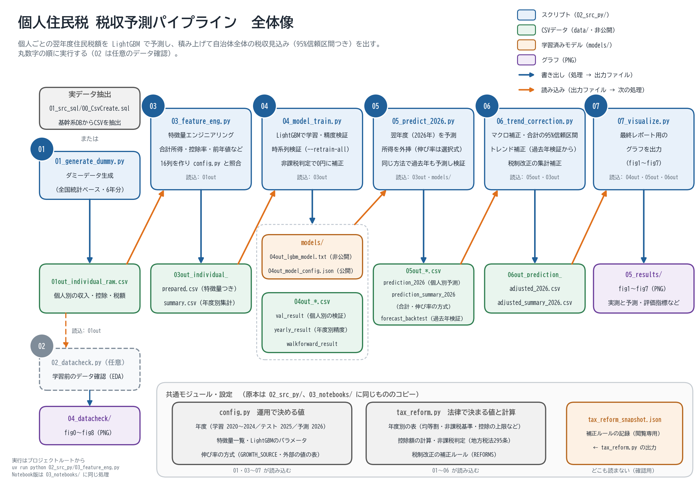

# 個人住民税予測モデル

## 概要
自治体におけるデータベースから過去の税額情報を取得し、翌年の税収を予測するモデル

### 課題

住民税は自治体の主要財源であり、翌年度の税収をどれだけ正確に見通せるかが予算編成の精度に直結する。既存の集計データにトレンドを補正した予測では、`予測精度`・`区間推定`・`税制改正`などの対応が課題となっている。

### 目的

個人の収入・控除情報をもとに翌年度の住民税額を予測し、自治体全体で積み上げて税収見込み額（95%信頼区間つき）を算出することで、より正確な予測を算出することを目的とする。

### 手法
個人の収入・控除情報をもとに翌年の住民税額を予測する機械学習モデルを構築するパイプラインである。LightGBM（勾配ブースティング）を用いて個人レベルの税額を推定し、それを集計することで自治体全体の税収見込みを算出する。

実務では実データをもとにプログラムを実行するが、GitHub にはダミーデータ生成機能を追加し、その出力データを元にプロジェクトを実行している。



> パイプラインの実行順とファイルの関係（`実行アウトライン概要図.png`）

---

## 本プロジェクトの役割

| 項目 | 内容 |
|---|---|
| 位置づけ | 予算編成での税収見込み算出を補助する**支援ツール**。出力（個人別予測・信頼区間・自治体合算値）は参考値であり、税額の決定・徴収は既存の税務基幹システムが担う |
| 対象範囲 | 個人住民税（均等割＋所得割）の翌年度税収予測に限定 |
| 処理の流れ | 基幹系から抽出した個人別の収入・控除データ（`01_src_sql/00_CsvCreate.sql`）を起点に、特徴量エンジニアリング→学習→翌年予測→マクロ補正→可視化。最終出力は「自治体全体の翌年度税収見込み額（信頼区間つき）」 |
| ダミー版の役割 | 実データがない段階でもパイプライン全体と精度検証手法を確認できるPoC用途。全国統計に基づく疑似データで代替 |
| 実データ版の役割 | 基幹系データを投入する本番想定。列名・控除計算式を実データに置き換える。控除をフラグでしか持たない場合は金額化の加工を追加（`03_feature_eng.py`） |
| 前提と限界 | 過去の実績パターンの学習に基づく。税制改正・急激な経済変動は`tax_reform.py`の`REFORMS`等の手動補正でカバーする。 |

---

## 結果の概要

> 詳細な検証条件・全指標は「[ダミーデータでの結果](#ダミーデータでの結果)」「[実データでの検証結果](#実データでの検証結果)」を参照。

| | 使用モデル | 検証データ規模 | 2026年度 税収予測 | 前年比 | 集計誤差率（テスト年2025）<br>モデル単体／本番と同じ方法 | 備考 |
|---|---|---|---:|---:|---:|---|
| ダミーデータ検証 | LightGBM（勾配ブースティング木） | 597,000件（6年分） | 244.85億円 | +7.01% | +0.01%／−0.25% | `06`の補正後。95%信頼区間 [236.10〜253.60] 億円（過去年検証の年ごとのぶれから算出）／WMAPE 0.53% |
| 実データ検証 | 同上 | 約1,340,000件（6年分） | 非公開 | +4.91% | +0.61%／未検証 | WMAPE 6.25%／個人単位の誤差（RMSE・R²）はダミーより大きいが、自治体全体の集計精度は既存ツールより向上した |

> 集計誤差率の「モデル単体」は、検証年の本当の特徴量で予測した誤差。「本番と同じ方法」は、`05`と同じく前年までのデータで学習し、前年のデータを外挿した特徴量で予測した誤差（過去年検証。ダミーの2022〜2025年の平均は −0.41%）。

- LightGBMで個人ごとの翌年度住民税額を予測し、自治体全体で積み上げることで、高精度に翌年度税収見込みを算出することが目的のモデルである。
- 個人単位の予測誤差は高所得層等の外れ値に引っ張られやすいが、自治体が最終的に必要とする「税収合計」への影響は限定的である（多くの誤差が相殺されるため）。
- 実データでも、非課税判定（地方税法295条）による強制0円補正や上限パーセンタイルでのクリップなど、税制ルールベースの後処理と組み合わせることで集計精度を担保している。

---

## 選定モデル

> LightGBM（勾配ブースティング木）

| 観点 | 内容 |
|---|---|
| 税額の計算が階段状 | 所得控除・非課税基準（地方税法295条）は「ある所得を境に切り替わる」構造。決定木は分割でそのまま表現でき、線形回帰のように閾値ごとの特徴量を人手で作る必要がない |
| 前処理が少ない | 分割は値の大小だけで決まるため、説明変数の対数変換や標準化が不要。自治体ごとに分布が違っても扱いやすい |
| 実データとの相性 | 基幹系DBからの抽出データは全項目が数値（性別・寡婦・障害者等もコード化済み）で、そのまま入力できる |
| 外れ値への耐性 | 高額納税者は個人単位の誤差（RMSE・WMAPE）を押し上げるが、主指標の集計誤差率への影響は小さい |
| 業務の引継 | 人事異動に伴う引継ぎにおいて、極力シンプルなデータ加工とモデル選定で運用することが望ましい |
---

## 実行方法

モデルの実行（学習・予測・補正・グラフ出力）はCLI版（`02_src_py/`）で行う。Notebook版（`03_notebooks/`）は、GitHub上で各ステップの処理内容と出力（表・グラフ）をそのまま読めるように置いている公開用である。

### 注意（`02_src_py/` と `03_notebooks/` の役割）

| | `02_src_py/`（CLI版） | `03_notebooks/`（Notebook版） |
|---|---|---|
| 役割 | モデル実行の本体（**原本**） | GitHub公開用。処理内容と実行結果（表・グラフ）を閲覧するために置いている |
| `config.py`・`tax_reform.py` | 原本 | 原本のコピー。ノートブックだけを取り出しても動くよう同じフォルダに置き、各ノートブックの先頭のセルで読み込み先に追加している |
| 変更するとき | ここを編集する | 原本を変えたあと、`config.py`・`tax_reform.py`をコピーし、ノートブックの該当セルにも同じ変更を入れ、上から実行し直して出力を更新する |

- 設定値やコードは必ず`02_src_py/`の原本を編集する。`03_notebooks/`だけを直すと、実行に使うCLI版に反映されないため注意。

### CLI版（`02_src_py/`）

```bash
# 実データがある場合（03から開始）
uv run python 02_src_py/03_feature_eng.py
uv run python 02_src_py/04_model_train.py --retrain-all   # walk-forward検証 + 全年再学習
uv run python 02_src_py/05_predict_2026.py
uv run python 02_src_py/06_trend_correction.py
uv run python 02_src_py/07_visualize.py

# ダミーデータで試す場合（01から開始）
uv run python 02_src_py/01_generate_dummy.py
uv run python 02_src_py/03_feature_eng.py
uv run python 02_src_py/04_model_train.py --retrain-all
uv run python 02_src_py/05_predict_2026.py
uv run python 02_src_py/06_trend_correction.py
uv run python 02_src_py/07_visualize.py
```

Windows PowerShellでも同じコマンドがそのまま使用可能

`02_src_py/`の中から実行する場合は、フォルダ名を除いて`uv run python 06_trend_correction.py`のように指定する。

### Notebook版(`03_notebooks/`)での実行

`03_notebooks/`配下に、各スクリプトと同一ロジックのJupyter Notebook版（`01_generate_dummy.ipynb`〜`07_visualize.ipynb`）を公開用として置いている。保存されている出力は、CLI版と同じ結果になることを確認して実行したもの。手元で実行して確かめることもできる。CLI版との違いは以下の通り。

- `main()`に集約せず、関数定義・実行・結果表示・保存をセル単位に分割しており、上から順に実行すると各ステップの出力（表・グラフ）がコード直下に表示される。
- CLI引数（`--walkforward`, `--year`等）に相当する設定は、各ノートブック内の`NOTEBOOK_ARGS`セルで指定する（`NOTEBOOK_ARGS = ["--retrain-all"]`のようにCLIと同じ文字列を並べる）。
- `04_model_train.ipynb`は、このREADMEに載せている結果と同じになるよう`NOTEBOOK_ARGS = ["--retrain-all"]`を設定済み。
- `03_notebooks/`から開いてそのまま実行してもプロジェクトルート基準の相対パスが解決できるよう、各ノートブックの先頭で自動的にカレントディレクトリをルートへ戻す処理が入っている。VS Code等で開く場合は`.venv`（`2026-chotei-01`）をカーネルに選択すること。


---

## フォルダ構成

```
.
├── 01_src_sql/     実データを基幹系DBから抽出するSQL
├── 02_src_py/      パイプライン本体（CLI版 01〜07）と、設定 config.py・税制ロジック tax_reform.py【原本】
├── 03_notebooks/   02_src_py と同じ処理のNotebook版（公開・閲覧用）
├── 04_datacheck/   データ確認用のグラフ（02_datacheck の出力。fig0〜fig8）
├── 05_results/     最終レポート用のグラフ（07_visualize の出力。fig1〜fig7）
├── data/           【非公開】入力・中間・予測結果のCSV
├── models/         【非公開】学習済みモデル 04out_lgbm_model.txt ／【公開】設定の記録 04out_model_config.json・tax_reform_snapshot.json
└── pyproject.toml / uv.lock / .python-version   Python環境の定義（uv sync で再現）
```

処理の流れ：`01_src_sql`（抽出）→ `data/` → `02_src_py`（加工・学習・予測。`03_notebooks`は同じ処理の公開用）→ `models/`・`04_datacheck/`・`05_results/`

各ファイルの中身や入出力の詳細は、次の「ファイル構成」を参照。

---

## ファイル構成

```
.
├── 01_src_sql/
│   └── 00_CsvCreate.sql          # 基幹系DBからの実データ抽出SQL
│
├── 02_src_py/                    # 実行スクリプト本体（CLI版。ルート／02_src_py どちらからでも実行可）
│   ├── config.py                 # 【原本】全設定値の一元管理（ここだけ触ればパラメータ調整可能）
│   ├── tax_reform.py             # 【原本】税制改正モジュール（計算式と補正ルール REFORMS）
│   │     out : models/tax_reform_snapshot.json（単独で実行したとき。補正ルールの記録）
│   │
│   ├── 01_generate_dummy.py      # ダミーデータ生成
│   │     in  : config.pyの設定値
│   │     out : data/01out_individual_raw.csv
│   │
│   ├── 02_datacheck.py           # データチェック（EDA・任意ステップ）
│   │     in  : data/01out_individual_raw.csv
│   │     out : 04_datacheck/*.png
│   │
│   ├── 03_feature_eng.py         # 特徴量エンジニアリング
│   │     in  : data/01out_individual_raw.csv
│   │     out : data/03out_individual_prepared.csv, data/03out_individual_summary.csv
│   │
│   ├── 04_model_train.py         # モデル学習・精度検証
│   │     in  : data/03out_individual_prepared.csv
│   │     out : models/04out_lgbm_model.txt, models/04out_model_config.json,
│   │           data/04out_val_result.csv, data/04out_yearly_result.csv,
│   │           data/04out_walkforward_result.csv（--walkforward/--retrain-all時のみ）
│   │
│   ├── 05_predict_2026.py        # 翌年度予測
│   │     in  : data/03out_individual_prepared.csv, models/04out_lgbm_model.txt, models/04out_model_config.json
│   │     out : data/05out_prediction_YYYY.csv, data/05out_prediction_summary_YYYY.csv,
│   │           data/05out_forecast_backtest.csv（過去年検証）
│   │
│   ├── 06_trend_correction.py    # マクロ補正（トレンド・税制改正）
│   │     in  : data/05out_prediction_YYYY.csv, data/05out_prediction_summary_YYYY.csv（伸び率の方式）,
│   │           data/05out_forecast_backtest.csv, data/03out_individual_prepared.csv
│   │     out : data/06out_prediction_adjusted_YYYY.csv, data/06out_prediction_adjusted_summary_YYYY.csv
│   │
│   └── 07_visualize.py           # グラフ出力
│         in  : 04〜06の出力CSV群, models/04out_model_config.json
│         out : 05_results/*.png
│
├── 03_notebooks/                 # 上記と同一ロジックのNotebook版（公開・閲覧用）
│   ├── config.py                 # 02_src_py/config.py のコピー（編集は原本側で行い、ここへ同期）
│   ├── tax_reform.py             # 02_src_py/tax_reform.py のコピー（同上）
│   │
│   ├── 01_generate_dummy.ipynb
│   ├── 02_datacheck.ipynb
│   ├── 03_feature_eng.ipynb
│   ├── 04_model_train.ipynb
│   ├── 05_predict_2026.ipynb
│   ├── 06_trend_correction.ipynb
│   └── 07_visualize.ipynb
│
├── 04_datacheck/                 # 02_datacheck.py の出力（EDA図。fig0〜fig8）
│
├── 05_results/                   # 07_visualize.py の出力（最終レポート図。fig1〜fig7）
│
├── data/                         # 【非公開】入力・中間・予測結果のCSV（フォルダごと .gitignore 対象）。実データ運用時もこのフォルダを使う
│   ├── 01out_individual_raw.csv        # 入力データ（実データ or ダミー）← 01 の出力
│   ├── 03out_individual_prepared.csv   # 特徴量追加済みデータ ← 03 の出力
│   ├── 04out_yearly_result.csv         # 年度別合算精度 ← 04 の出力
│   ├── 04out_val_result.csv            # 個人別検証結果 ← 04 の出力
│   ├── 04out_walkforward_result.csv    # walk-forward各フォールドの精度（--walkforward/--retrain-all時のみ）← 04 の出力
│   ├── 05out_prediction_2026.csv       # 個人別予測値 ← 05 の出力
│   ├── 05out_prediction_summary_2026.csv  # 合計・信頼区間・使った伸び率の方式 ← 05 の出力
│   ├── 05out_forecast_backtest.csv     # 05 と同じ方法で過去年を予測した誤差（06 のトレンド補正の根拠）← 05 の出力
│   ├── 06out_prediction_adjusted_2026.csv  # 補正後予測値 ← 06 の出力
│   └── 06out_prediction_adjusted_summary_2026.csv  # 補正後の合計・95%信頼区間 ← 06 の出力
│
└── models/                       # フォルダ内は .gitignore 対象だが、04out_model_config.json と tax_reform_snapshot.json だけ除外設定で公開
    ├── 04out_lgbm_model.txt            # 【非公開】学習済みモデル ← 04 の出力
    ├── 04out_model_config.json         # 【公開】学習時の設定の記録（使った特徴量・学習年・パラメータ・検証モード）← 04 の出力
    └── tax_reform_snapshot.json  # 【公開】税制改正の補正ルールの記録（閲覧専用・編集しない）← tax_reform.py の出力
```

**【非公開】** は `.gitignore` 対象でGitHubに公開されない。フォルダに付いている場合は中身すべてが対象。上記のほか `__pycache__/`・`*.pyc`・`.venv/` も対象だが、ツリーには記載していない。

> `data/`と`models/04out_lgbm_model.txt`（学習済みモデル）は`.gitignore`対象（非公開）。`models/04out_model_config.json`だけは、このREADMEの結果がどの特徴量・学習年・検証モードで出たかを`config.py`を開かなくても確認できるよう公開している。`models/tax_reform_snapshot.json`も公開しており、`tax_reform.py`の`REFORMS`（補正ルールの唯一の正）の内容を書き出した閲覧専用の記録である。学習済みモデルは実データ由来の情報を含み得るため公開しない。

- 出力ファイル名の先頭2桁は、そのファイルを書き出したパイプラインのステップ番号を示す（例: `03out_`＝`03_feature_eng.py`の出力、`04out_model_config.json`＝`04_model_train.py`の出力）。例外は、番号付きのステップではなく`tax_reform.py`が書き出す`tax_reform_snapshot.json`。
- 実データCSVに必要な列は `01_src_sql/00_CsvCreate.sql` にて指定。

---

## ダミーデータでの結果

> `01_generate_dummy.py`→`03_feature_eng.py`→`04_model_train.py --retrain-all`→`05_predict_2026.py`→`06_trend_correction.py`→`07_visualize.py`を最新コードで再実行した結果。

### 検証条件

| 項目 | 内容 |
|---|---|
| データ種別 | ダミーデータ（`01_generate_dummy.py`生成、全国統計ベース） |
| 使用スクリプト | ダミー版 無印（`02_src_py/01〜07_*.py`） |
| 実行コマンド・オプション | `04_model_train.py --retrain-all`（walk-forward検証＋全年再学習） |
| 学習データ年度範囲（`TRAIN_YEARS`） | 2020〜2024年（`--retrain-all`のため最終モデルは`TEST_YEAR`含む2020〜2025年で再学習） |
| テスト年度（`TEST_YEAR`）／予測年度（`PREDICT_YEAR`） | 2025年 ／ 2026年 |
| レコード数 | 597,000件（6年分、1年あたり98,800〜100,000件） |

### 評価指標（TRAIN in-sample / ウォークフォワード最終フォールド TEST out-of-sample）

| 指標 | 意味・式 | TRAIN（2020〜2025 in-sample） | TEST（fold4: train=2020〜2024→test=2025） | 備考 | 位置づけ |
|---|---|---|---|---|---|
| 集計誤差率 | 合計のズレの割合<br>（予測合計−実績合計）÷実績合計 | -0.00% | +0.01% | 符号付きのため、個人ごとの誤差のプラス・マイナスが打ち消し合う |（**主指標**）税収見込みの精度そのもの |
| WMAPE | 円で重み付けした誤差率<br>Σ\|誤差\|÷Σ実績 | 0.48% | 0.53% | 非課税者含む。集計誤差率の上限（全員が同じ向きに外れた場合に一致） |（第2指標）円ベース：税収のうち何円分を個人に誤って割り振ったか。高額納税者の外れは税額に比例して効く |
| MAPE | 1人ずつの誤差率の平均<br>平均(\|誤差\|÷実績) | 1.59% | 1.38% | 課税者のみ（実績0円は分母にできないため除外） |（参考）人数ベースで、一般の納税者1人ひとりの当たり具合。少額納税者の外れで大きくなり、非課税者の誤予測は反映されない |
| MAE | 1人あたりの平均誤差額<br>平均(\|誤差\|) | 971円 | 1,227円 | | （参考）1人あたり平均何円外れるかの把握。税収合計の精度判断には使わない |
| RMSE | 二乗平均の平方根<br>√平均(誤差²) | 2,348円 | 4,560円 | |（参考）高額納税者など大きな外れの荒れ具合の確認。外れ値に引っ張られるため、税収合計の精度判断には使わない |
| R² | 税額のばらつきの説明割合<br>1−Σ誤差²÷Σ(実績−平均)² | 1.000 | 1.000 | |（参考）個人単位の当てはまりを税額の規模によらず比べるための指標（RMSEを税額のばらつきで割ったもの）。ダミーと実データ、年度間で見比べて異変に気づくために計算しており、税収合計の精度判断には使わない |


### 年度別合算精度（`04`最終モデルによる in-sample、参考値）

| 年度 | 実測（億円） | 予測（億円） | 集計誤差率 |
|---:|---:|---:|---:|
| 2020 | 179.87 | 179.85 | -0.01% |
| 2021 | 192.30 | 192.25 | -0.03% |
| 2022 | 196.62 | 196.66 | +0.02% |
| 2023 | 205.66 | 205.68 | +0.01% |
| 2024 | 215.66 | 215.65 | -0.00% |
| 2025 | 228.80 | 228.80 | -0.00% |

### 05 方式の過去年検証（`05out_forecast_backtest.csv`、`06`のトレンド補正の根拠）

前年までのデータで学習し、前年のデータを外挿した特徴量で予測した結果（本番の`05`と同じ方法）。上の表やウォークフォワードと違い、外挿の誤差も含む。

| 年度 | 実測（億円） | 予測（億円） | 集計誤差率 | 1人あたり誤差率 |
|---:|---:|---:|---:|---:|
| 2022 | 196.62 | 198.37 | +0.89% | +0.68% |
| 2023 | 205.66 | 202.60 | -1.49% | -1.39% |
| 2024 | 215.66 | 213.95 | -0.79% | -1.78% |
| 2025 | 228.80 | 228.23 | -0.25% | -0.25% |
| 平均 | | | -0.41%（標準偏差 1.00%） | |

### 2026年度予測サマリー（`05`→`06`）
実際に比較する数字がないため、予測結果のみ表示。
> 実データは実際の集計結果と突合して精度検証する。

| 項目 | 値 |
|---|---|
| 前年実績（2025年） | 228.80億円 |
| 2026年度 税収合計（最終・`06`の補正後） | 244.85億円（前年比 +7.01%）※`05`の予測は243.85億円 |
| 予測人数（うち課税者数） | 98,800人（78,710人） |
| 95%信頼区間（`06`の補正後） | [236.10 〜 253.60] 億円（過去年検証の年ごとのぶれ・t分布・4年。参考: 個人別の区間の合計は [240.85 〜 249.04]） |
| 所得の外挿率（実績トレンド直近2年平均） | 給与収入 +6.78%／事業所得 +0.73%／年金収入 +2.26%（年金所得は控除を引き直して計算） |
| `06`トレンド補正 | 乗率 1.0041（過去年検証の平均誤差率 -0.41% を打ち消す） |
| `06`税制改正マクロ補正 | 適用する補正なし |

### 所見・特記事項

- ウォークフォワード検証（fold1〜4）はすべて誤差率±0.1%以内・個人MAPE 1.4〜1.7%におさまり、安定している。
- 予測値の押し上げ要因は給与収入トレンド（直近2年平均 +6.78%）が最大で、年金収入（+2.26%）・事業所得（+0.73%）もプラス方向に外挿されている。
- ダミーの精度（R² 1.000・WMAPE 0.53%）が高いのは、ダミーの税額を、特徴量に含まれる課税標準額などから同じ計算式で作っているためで、特徴量が分かれば税額がほぼ決まる。実データは控除の持ち方や特定区間の偏り・外れ値があり、同じ精度にはならない（実データの WMAPE は 6.25%）。データ加工等のフロー設定は、自治体ごとに検証する必要がある。

---

## 実データでの検証結果

- 下記は実データをもとに検証した結果である。
- 金額は非公開とし、評価指標と集計誤差のみを記載する。
- ダミーデータとの相違点や別途の取り組み、今後の課題等を記載

### 検証条件

| 項目 | 内容 |
|---|---|
| データ種別 | 実データ（`01_src_sql/00_CsvCreate.sql`より csvデータ抽出） |
| 使用スクリプト | 実データ版（03〜07。非公開） |
| 実行コマンド・オプション | `04_model_train.py --retrain-all`（walk-forward検証＋全年再学習） |
| 学習データ年度範囲（`TRAIN_YEARS`） | 2020〜2024年（`--retrain-all`のため最終モデルは`TEST_YEAR`含む2020〜2025年で再学習） |
| テスト年度（`TEST_YEAR`）／予測年度（`PREDICT_YEAR`） | 2025年 ／ 2026年 |
| レコード数 | 約1,340,000件（6年分、1年あたり約220,000件） |

### 評価指標（TRAIN / TEST）

| 指標 | 意味・式 | TRAIN | TEST | 備考 | 位置づけ |
|---|---|---|---|---|---|
| 集計誤差率 | 合計のズレの割合<br>（予測合計−実績合計）÷実績合計 | +0.25% | +0.61% |  |（**主指標**）税収見込みの精度そのもの |
| WMAPE | 円で重み付けした誤差率<br>Σ\|誤差\|÷Σ実績 | 4.38% | 6.25% | 非課税者含む。集計誤差率の上限 |（第2指標）円ベース：税収のうち何円分を個人に誤って割り振ったか。高額納税者の外れは税額に比例して効く |
| MAPE | 1人ずつの誤差率の平均<br>平均(\|誤差\|÷実績) | 8.46% | 11.52% | 課税者のみ（実績0円は除外） |（参考）人数ベースで、一般の納税者1人ひとりの当たり具合。少額納税者の外れで大きくなり、非課税者の誤予測は反映されない |
| MAE | 1人あたりの平均誤差額<br>平均(\|誤差\|) | 3,833円 | 5,897円 | 円 |（参考）1人あたり平均何円外れるかの把握。税収合計の精度判断には使わない |
| RMSE | 二乗平均の平方根<br>√平均(誤差²) | 126,006円 | 176,853円 | 円 |（参考）高額納税者など大きな外れの荒れ具合の確認。外れ値に引っ張られるため、税収合計の精度判断には使わない |
| R² | 税額のばらつきの説明割合<br>1−Σ誤差²÷Σ(実績−平均)² | 0.818 | 0.712 | |（参考）個人単位の当てはまりを税額の規模によらず比べるための指標（RMSEを税額のばらつきで割ったもの）。ダミーと実データ、年度間で見比べて異変に気づくために計算しており、税収合計の精度判断には使わない |


### 年度別合算精度（`04`最終モデルによる in-sample、参考値）

| 年度 | 実測（億円） | 予測（億円） | 集計誤差率 | 
|---:|---:|---:|---:|
| 2020 | 非公開 | 非公開 | -0.36% |
| 2021 | 非公開 | 非公開 | +0.16% |
| 2022 | 非公開 | 非公開 | +0.01% |
| 2023 | 非公開 | 非公開 | -0.23% |
| 2024 | 非公開 | 非公開 | +0.42% |
| 2025 | 非公開 | 非公開 | +0.61% |

### 2026年度予測サマリー（`05`→`06`）

| 項目 | 値 | 備考 |
|---|---|---|
| 2026年度 税収合計予測 | 前年比 +4.91% | 税制改正（減税）以上に所得の上昇に伴った税収の増加が継続 |
| 2026年度予測と実績の集計誤差率（2026年6月30日時点） | 0.41% | 年度途中時点の暫定値。上の評価指標表にある集計誤差率（テスト年2025の+0.61%）とは別の数値 |
| 予測人員 | 約220,000人 | |


### 所見・特記事項
- ダミーデータを用いた結果と比べて精度が低いことが伺える。ダミーデータが正規分布に近い形状であるのに対し、実データは特定区間の偏りや外れ値が顕著であったことが主な原因と考えられる。個人単位の精度は誤差が大きいものの、本プロジェクトの目的である、税収の予測から鑑みると、集計誤差率の精度としてはダミーデータ同等の精度を保つことができていると読み取れる。
- 一定数極端に税額が大きい納税者（詳細は非公表）が存在するため、多少の予測誤差が発生する。その上で学習精度のために、実データのみパーセンタイルでクリップし、値を丸めるなどのデータ加工を実装した。その影響で`05`の予測の集計結果が実データの結果より過小になったことが伺える。ただし、少数の高額納税者については、単年の高額所得の可能性や、転出・死亡による翌年の税収0円等の可能性を考慮すると、前年データをそのまま予測に用いるよりはリスクを抑えられることから、学習段階でのデータの上限設定は有効と考える。

### 実データにおける取り組み
> 各団体によって人口推移、所得平均、分布等が異なるため、部分的なカスタマイズ処理は必要である。下記は一例。

#### ダミー版との主な相違点

| 項目 | ダミー版（`02_src_py/`） | 実データ版 |
|---|---|---|
| 所得列 | 全国統計ベースで生成した個別所得列。`03`で合計して`総所得金額等`を作る | 抽出データに合計所得の列が既にあるためそのまま使用 |
| 障害者・寡婦・配偶者・扶養控除 | 金額列として生成 | 抽出データはコード値・人数で持つため、`03`で住民税の控除額表に基づき金額へ変換 |

#### 今後の課題

- 2026年予測では、対象者を2025年と同じ人・同じ人数とし、全員を継続者として扱っている（死亡・転出・転入と加齢は反映していない）。ダミー版で「伸び率を継続者ベースにする＋入れ替わり補正」「年齢を1歳進める」を試算したが、過去年検証の誤差は小さくならなかったため見送った。実データは検証中。
- 2024年定額減税による税収への影響について、本モデルでは定額減税前の税額に戻して学習している。今後同様の税制改正における`tax_reform.py`の精度検証が必要。
- 所得上位数%の高額所得者の細分化。所得別の翌年継続率（給与なら継続確率高、分離所得なら低等の仮説）を把握し、誤差を反映する等の対応が必要。


---
## まとめ
| | 詳細 |
|---|---|
| 目的 | 本プロジェクトにおける最優先事項（`税収予測の精度向上`）については既存ツールよりも前進しており、目的の一部は達成した。|
| 課題1 | 過去６年はいずれも上昇トレンドを形成しており、前年までの結果が直線的に反映されやすい傾向にある。今後、トレンドが崩れたり、2024年のような大きな税制改正があった際に同等の精度を担保できるよう改修が必要 | 
| 課題2 | 課題1における精度向上を目指す一方、職員間での業務引継や汎用的な運用を確保する観点から、データ加工は必要最小限で行うことも目指す。|


---

## 各ファイルの詳細

各スクリプトの役割と、代表的なオプション・留意点。入出力ファイルは「[ファイル構成](#ファイル構成)」を参照。

### `02_src_py/config.py` — 設定値の一元管理

運用で決める値を集約する。法律・条例で決まる値（均等割・非課税基準など）は`tax_reform.py`にある。

| 設定グループ | 主な設定項目 |
|---|---|
| 年度 | `TRAIN_YEARS`, `TEST_YEAR`, `PREDICT_YEAR` |
| モデル・検証 | `LGBM_PARAMS`, `VALIDATION_MODE`, `CONFORMAL_COVERAGE` |
| 予測の伸び率（05） | `GROWTH_SOURCE`, `FORECAST_GROWTH_TABLE`, `WAGE_RATE_OVERRIDE` |
| 税額控除の推計（05） | `FURUSATO_PARAMS`, `HOUSING_PARAMS` |
| ダミー生成（01） | `N_PER_YEAR`, `TURNOVER_RATE`, `POPULATION_GROWTH_RATES`, `AGE_WEIGHTS`, `GENDER_RATIO`, `SALARY_GROWTH_RATES`, `PENSION_GROWTH_RATES` |

---

### `02_src_py/01_generate_dummy.py` — ダミーデータ生成

全国統計（国税庁の民間給与実態統計、厚生労働省の年金受給額・医療費、総務省の年齢構成など）をもとに、6年分の個人別の収入・控除・税額を生成する。毎年`TURNOVER_RATE`（5%）の人が入れ替わり、給与・年金は`SALARY_GROWTH_RATES`・`PENSION_GROWTH_RATES`で年ごとに伸ばす。

- 個別自治体の特性は反映していない。事業所得・不動産所得は赤字（マイナス）の人も含む。

---

### `02_src_py/02_datacheck.py` — データチェック（EDA・任意）

入力データを可視化し、`04_datacheck/`に fig0〜fig8 を出力する。課税・非課税の人数、所得と年税額の分布、年税額との相関、年齢・性別ごとの分布、所得の年度推移、税額控除、定額減税の影響を確認する。モデル学習の前のデータ確認用で、パイプラインの必須ステップではない。

---

### `02_src_py/03_feature_eng.py` — 特徴量エンジニアリング

合計所得（`総所得金額等`）、所得種別のフラグ、控除率・課税標準率、年齢区分番号、前年の値（`前年_年税額`等）と前年差など、モデルの入力になる列を作る。

- 税額の内訳列（`LEAK_COLS`）は、合計すると目的変数になるため特徴量から除外する（リーク防止）。

---

### `02_src_py/04_model_train.py` — モデル学習・精度検証

LightGBM で個人の年税額を学習・検証する。予測値は、課税者は均等割を下限にし、非課税基準に該当する人は0円に上書きする。

| オプション | 動作 |
|---|---|
| `--standard`（既定） | `TRAIN_YEARS` で学習し、`TEST_YEAR` で評価（1回のホールドアウト） |
| `--walkforward` | 時系列のクロスバリデーション（fold1〜fold4） |
| `--retrain-all` | walk-forward で検証したあと、全年で再学習（運用時の推奨。このREADMEの結果） |

- 主指標は集計誤差率（予測合計と実績合計の差）。各指標の意味は「[ダミーデータでの結果](#ダミーデータでの結果)」の評価指標の表を参照。
- `year` は特徴量に含めない（木モデルは学習範囲外の年を外挿できないため）。予測年の所得の伸びは`05`の外挿で与える。

---

### `02_src_py/05_predict_2026.py` — 翌年度予測

直近年のレコードをコピーし、給与・年金・事業所得を伸ばして予測年の特徴量を作り、全年で再学習したモデルで予測する。予測のあと、同じ方法で過去年（2022〜2025年）を予測して実績と比べる**過去年検証**を行い、`06`のトレンド補正と信頼区間の根拠にする。

```bash
uv run python 02_src_py/05_predict_2026.py --growth table      # 伸び率を外部の値の表から取る（none で伸ばさない）
uv run python 02_src_py/05_predict_2026.py --wage-rate 0.025   # 給与の伸び率を直接指定
uv run python 02_src_py/05_predict_2026.py --no-backtest       # 過去年検証を省略（約30秒短縮）
```

- 伸び率の指定方法は「[予測の伸び率を指定したいとき](#予測の伸び率を指定したいとき春闘年金改定率など)」を参照。

---

### `02_src_py/06_trend_correction.py` — マクロ補正

`05`の予測に集計レベルの補正を掛け、補正後の合計と95%信頼区間を出力する（`07`の fig4・fig6 がこの値を使う）。

| 補正 | 内容 |
|---|---|
| トレンド補正 | 過去年検証の平均誤差率を打ち消す乗率（現在 1.0041）。`--no-trend` で無効、`--factor` で直接指定 |
| 税制改正の集計補正 | 個人データで表せない改正（扶養要件の引き上げ等）の影響を、課税者数から推計して加減算（現在は無効） |

- 合計の95%信頼区間は、過去年検証の年ごとのぶれから t 分布で作る（4年分のため広め）。個人別CSVの個人ごとの区間の合計とは一致しない。

---

### `02_src_py/07_visualize.py` — グラフ出力

`05_results/`に fig1〜fig7 を出力する。

| 図 | 内容 |
|---|---|
| fig1 | 年度別の実測と予測 |
| fig2 | 個人の予測誤差の分布 |
| fig3 | 年齢区分別の税額と人数（予測年） |
| fig4 | 予測の中央値と95%信頼区間（`06`の補正後）、数値の表 |
| fig5 | 評価指標の表と年度別の誤差率 |
| fig6 | 実績の推移と、予測年の予測値・95%信頼区間 |
| fig7 | walk-forward のフォールド別精度（`--walkforward`／`--retrain-all` のとき） |

---

### `02_src_py/tax_reform.py` — 税制のルール

法律・条例で決まる値と計算、税制改正の補正ルールを持つ共通モジュール。

| 部分 | 内容 |
|---|---|
| 年度別の表（冒頭） | 均等割・非課税基準・給与所得控除の最低額・住宅ローン控除の上限など。改正されたら施行年度の行を足す。均等割と非課税基準は自治体固有の値 |
| `compute_*` 関数 | 給与所得控除・公的年金等控除・基礎控除・非課税判定（地方税法第295条）などの計算 |
| `REFORMS`（末尾） | 期間限定の補正と、`06`の集計補正。`active`で切り替える（現在はすべて無効）。書き方は「[税制改正に対応したいとき](#税制改正に対応したいとき)」 |

- 住民税と所得税では控除額が異なる（例: 生命保険料控除の上限は住民税7万円、所得税12万円）。

---


## 設定値の変更ガイド

設定値はすべて`02_src_py/`の原本を編集する（公開用の`03_notebooks/`へはコピーで反映する）。

### 年度を更新したいとき

毎年の運用で必ず行う。`config.py`の年度を1年ずつ進める。

```python
# config.py
TRAIN_YEARS  = [2020, 2021, 2022, 2023, 2024, 2025]  # 訓練年を追加
TEST_YEAR    = 2026                                   # テスト年を更新
PREDICT_YEAR = 2027                                   # 予測年を更新
```

あわせて次を確認する。

1. 税制改正があった年度は、`tax_reform.py`冒頭の年度別の表に施行年度の行を足す（「[税制改正に対応したいとき](#税制改正に対応したいとき)」）。
2. 伸び率の方式を table にしている場合は、`FORECAST_GROWTH_TABLE`に新しい予測年度の値を足す（欠けているとエラーで止まる）。
3. ダミーデータを作り直す場合は、`POPULATION_GROWTH_RATES`・`SALARY_GROWTH_RATES`・`PENSION_GROWTH_RATES`に新しい年を足す。

### 予測の伸び率を指定したいとき（春闘・年金改定率など）

`05`が直近年の所得を伸ばすときの伸び率は、既定では実績から自動で決める。外部の値を使うとき、または伸ばさないときは次のように指定する。

| 方式 | 指定方法 | 内容 | `06`の自動のトレンド補正 |
|---|---|---|---|
| auto（既定） | `config.py`の`GROWTH_SOURCE = "auto"` | 実績の全員平均の直近2年の伸び率（給与・年金・事業所得） | 掛ける |
| table | `GROWTH_SOURCE = "table"`または`--growth table` | `FORECAST_GROWTH_TABLE`の値（給与・年金。事業所得は自動） | 掛ける |
| none | `GROWTH_SOURCE = "none"`または`--growth none` | 伸び率0%（直近年の所得のまま） | 掛けない |
| 直接指定 | `--wage-rate 0.0525`・`--pension-rate 0.019`（上乗せは`--wage-delta`） | 方式より優先する | 掛けない |

```python
# config.py（キーは住民税の年度、値は前年の所得の伸び率。例: 2026年度 ← 2025年の春闘）
GROWTH_SOURCE = "table"
FORECAST_GROWTH_TABLE = {
    "給与収入":          {2022: ..., 2023: ..., 2024: ..., 2025: ..., 2026: ...},
    "雑収入_公的年金等": {2022: ..., 2023: ..., 2024: ..., 2025: ..., 2026: ...},
}
```

- table では、予測年度に加えて過去年検証の年度（2022〜2025）の値も要る。`06`の乗率と信頼区間は、本番と同じ方式で行った過去年検証から作るため。
- 方式を変えたら、`05`を`--no-backtest`なしで実行し直す（方式が一致しないと`06`は自動の乗率を掛けず、理由を表示する）。
- 使った方式と伸び率は`05out_prediction_summary_YYYY.csv`に残る。表の値は既定で空で、実際の値と出典は運用で決める。

全く補正しない場合は、`05 --growth none`と`06 --no-trend`を組み合わせる（税制改正の補正は既定で無効）。

### 税制改正に対応したいとき

改正の種類によって書く場所が違う。同じ改正を両方に書くと二重に適用される。

| 改正の種類 | 書く場所 | 例 |
|---|---|---|
| 恒久的な改正（金額・基準が変わる） | `tax_reform.py`冒頭の年度別の表に、施行年度の行を足す | 給与所得控除の最低額（2026年度〜65万円）、均等割、非課税基準 |
| 期間限定の補正、個人データでは表せない改正 | `tax_reform.py`末尾の`REFORMS`に辞書を1つ足す | 定額減税（2024年）、扶養要件の引き上げ（`06`の集計補正） |

`REFORMS`に足すときの手順:

1. 新しい計算が必要な場合だけ、`tax_reform.py`に補正関数（`_apply_<name>`）を書く。
2. `REFORMS`に辞書を1つ足す。

```python
{
    "name": "teigaku_reduction",          # 識別子
    "func": _apply_teigaku_reduction,     # 補正関数（06 の集計補正は None）
    "reform_type": "label_correction",    # 04で学習ラベル / feature_correction=05で特徴量 / macro_correction=06で集計値
    "effective_year": 2024,               # 施行年度
    "one_time": True,                     # True=施行年のみ
    "active": False,                      # False なら補正しない
    "params": {"amount_per_person": 10_000},
    "memo": "備考",
},
```

3. `uv run python 02_src_py/tax_reform.py`を実行し、記録（`models/tax_reform_snapshot.json`）を更新する（忘れると`04`が警告する。結果には影響しない）。

### 特徴量を追加・削除したいとき

モデルに使う列は`config.py`の2つの一覧で管理し、`FEATURE_COLS`はその2つをつないだもの。

```python
# config.py
RAW_FEATURE_COLS = [...]        # 元データにある列のうち、モデルに使うもの
GENERATED_FEATURE_COLS = [...]  # 03_feature_eng.py の preprocess() が作る列
FEATURE_COLS = RAW_FEATURE_COLS + GENERATED_FEATURE_COLS
```

| やりたいこと | 直す場所 |
|---|---|
| 元データにある列を使う・外す | `RAW_FEATURE_COLS`に書き足す・消す |
| `03`で新しい列を作る | `preprocess()`に処理を書き、`GENERATED_FEATURE_COLS`にも同じ列名を書き足す |
| `03`で作っている列を外す | `preprocess()`の処理と`GENERATED_FEATURE_COLS`の両方から消す |

- `03`は、`GENERATED_FEATURE_COLS`と実際に作った列がずれているとエラーで止まる（片方だけの直し忘れを防ぐため）。
- 変更後は`03`→`04`→`05`を実行し直す。

### その他の設定（補足）

| やりたいこと | 設定 |
|---|---|
| 予測年の人口の増減を反映する | `06 --factor 0.988`（テスト年より1.2%減る想定）。指定すると自動のトレンド補正は使わない |
| 検証モードの既定を変える | `config.py`の`VALIDATION_MODE`（既定`"standard"`。このREADMEの結果は`--retrain-all`） |
| ダミーデータの規模を変える | `N_PER_YEAR`（1年あたりの人数）、`TURNOVER_RATE`（毎年の入れ替わり率） |
| ダミーデータを自治体の実態に近づける | `AGE_WEIGHTS`（年齢構成）、`GENDER_RATIO`（男女比）、`POPULATION_GROWTH_RATES`（年別の人口倍率） |
| ダミーデータの賃金・年金の上昇率を変える | `SALARY_GROWTH_RATES`・`PENSION_GROWTH_RATES`（ダミー生成専用。予測には使わない）。`APPLY_WAGE_GROWTH = False`で全年一律 +0.5% |

---


## 環境

```bash
# 依存パッケージのインストール（pyproject.toml / uv.lock を元に .venv を構築）
uv sync
```

主要ライブラリ：`lightgbm`, `pandas`, `numpy`, `scikit-learn`, `scipy`（合計の信頼区間の t 分布）, `matplotlib`, `jupyter`

Python 3.14以上を想定している（`.python-version`参照）。

---

## 注意事項

- GitHubで公開しているのはダミーデータ版であり、掲載している実データの検証結果は評価指標と誤差率のみを示している。実際の税収予測に使用する際は、実データによる再学習と十分な検証を行うこと。
- 住民税の計算式は自治体・年度によって一部異なる場合がある（級地区分による非課税ラインの違い、均等割の超過課税等）。ダミー版は所得割の標準税率（10%）、1級地の非課税範囲、超過課税を含む均等割（5,300円）を前提としている。自治体に合わせるときは`tax_reform.py`冒頭の年度別の表を直す。
- 個人情報を含む実データを扱う場合は、データの取扱いポリシーに従うこと。`data/`・`models/`フォルダはこの理由から常に`.gitignore`対象とし、GitHubには公開しない。
